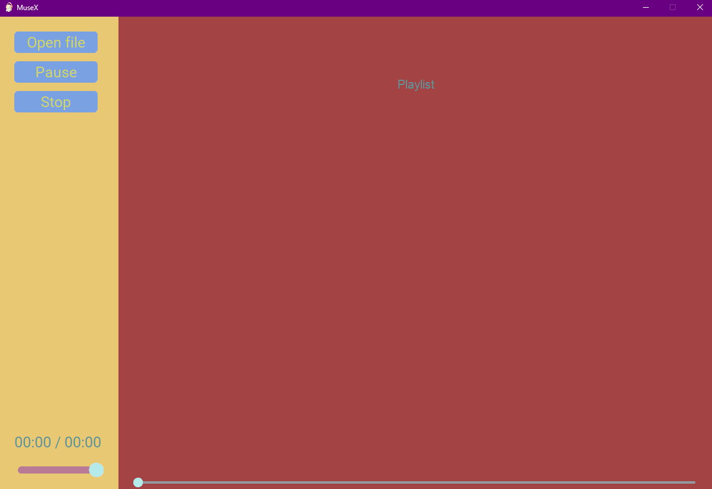

# MusicPlayerPy
Python based music player made using pygame for sound control and ctk(customtkinter) for UI

## Requirements
To install all the required libraries run ``pip3 install -r requirements.txt``.
